<div align="center">

# PathAI

### Your practical AI/ML learning companion - from first concept to career readiness

<p><strong>ACT AI Course Final Project | Government of Pakistan</strong></p>

<a href="https://act-ai-learning-assistant-rais.vercel.app/"></a>
<a href="#visual-product-tour"></a>

<br><br>


</div>

> [!TIP]
> **Try PathAI now:** [https://act-ai-learning-assistant-rais.vercel.app/](https://act-ai-learning-assistant-rais.vercel.app/)

PathAI is a browser-based learning platform that makes advanced AI and machine-learning education more approachable, organized, and actionable. It brings together personalized study planning, an AI tutor, code debugging, resume feedback, activity tracking, and professional notifications in one focused workspace.

Built as a final project for the **ACT AI Course, Government of Pakistan**, PathAI is designed for students, graduates, aspiring AI/ML professionals, career changers, and curious citizen learners who need a clearer path through fast-moving technical subjects.

<p align="center">
  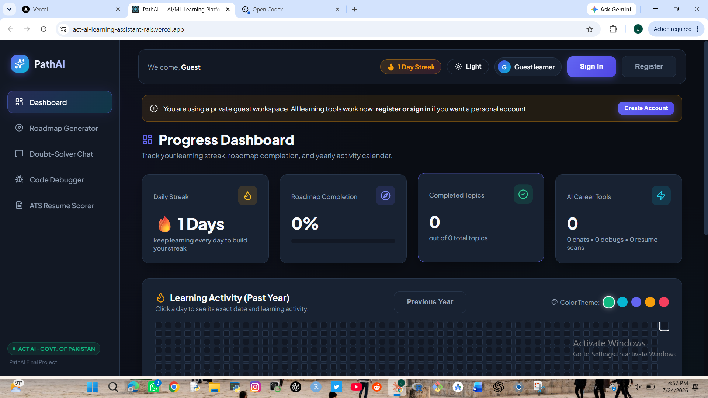
</p>

## Why PathAI

Learning AI/ML can feel fragmented: a learner may use one place for roadmaps, another for questions, another for debugging, and still another for career preparation. PathAI connects these stages of learning into a single practical journey.

| Learner challenge | How PathAI responds |
| --- | --- |
| Not knowing what to study next | Generates structured week-by-week AI/ML roadmaps tailored to a goal, skill level, and available study hours. |
| Getting stuck on complex concepts | Provides an AI tutor with chat, flashcards, quizzes, exports, and visual flowcharts. |
| Losing time on code errors | Explains likely causes, shows a safer corrected pattern, and describes expected behavior. |
| Unclear career readiness | Scores resumes against a target role and provides concrete improvement guidance. |
| Difficulty staying consistent | Tracks completed roadmap topics, learning activity, and a rolling year of progress. |
| Wanting to try before registering | Supports a private guest workspace as well as registered accounts. |

## Final-project submission at a glance

| Requirement | PathAI evidence |
| --- | --- |
| Original idea solving a real problem | PathAI addresses the fragmented AI/ML learning journey: planning what to learn, getting help, debugging code, and improving career readiness from one workspace. |
| Complete end-to-end app | Learners can use the dashboard, roadmap generator, tutor chat, code debugger, resume scorer, history views, exports, and responsive mobile interface. |
| AI-powered feature | The tutor, roadmap generation, code debugger, flashcards, quizzes, and resume guidance use an OpenRouter-compatible AI service with purpose-written instructions. |
| Public source code | [View the GitHub repository](https://github.com/javariaazeemkhan478-crypto/act-ai-learning-assistant). |
| Live deployment | [Open the working PathAI app](https://act-ai-learning-assistant-rais.vercel.app/). |
| Screenshots and run guide | This README includes an 11-step visual walkthrough and complete local/deployment instructions below. |

## A complete learning journey

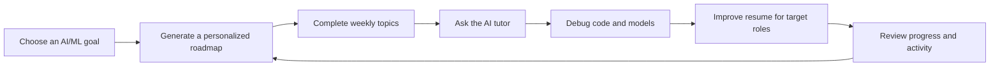

## Core capabilities

### Personalized roadmap generator

- Creates practical, week-by-week AI/ML learning plans.
- Adapts the plan to a selected goal or sub-field, skill level, and hours available each week.
- Lets learners tick off completed weeks and topics instantly.
- Stores roadmap history so previous learning plans can be reviewed.
- Exports a learning plan as a PDF.

### AI tutor and doubt-solver chat

- Starts new conversations and keeps a searchable chat history.
- Works on desktop and mobile with a compact, accessible chat-history drawer.
- Supports questions through text and file attachments.
- Generates flashcards and MCQ quizzes for revision.
- Exports notes as PDF.
- Renders visual flowcharts directly as diagrams, not only as text prompts.
- Lets learners remove conversations with a clear, professional confirmation dialog.

### AI feature: instructions written for PathAI

PathAI uses a purpose-written tutor instruction, rather than a generic chat experience. The application asks the model to act as an expert AI/ML tutor, explain ideas in accessible language, use intuitive examples, reduce unnecessary jargon, connect explanations to practical machine-learning use cases, and return readable Markdown with code where useful.

The effective system instruction is:

```text
You are PathAI, an expert AI/ML tutor. Explain concepts in simple, accessible terms
with clear intuitive examples. Assume the student is actively learning, avoid unnecessary
academic jargon, and always relate answers back to practical machine learning use cases.
Use formatted markdown with code snippets where helpful.
```

For reliability, the Visual Flowchart action uses a PathAI-generated Mermaid learning path rather than trusting a model to produce raw diagram syntax. This gives learners an immediate, valid visual diagram even when an external AI provider is slow or returns malformed markup.

### Multi-language code and model debugger

- Accepts code snippets and error traces.
- Supports language/framework selection or automatic detection.
- Returns the likely reason, a safer corrected pattern, expected output or behavior, and next debugging steps.
- Uses a dependable built-in analysis fallback when the external AI service is slow or unavailable, so learners still receive useful feedback.

### AI/ML ATS resume scorer

- Uploads a resume as PDF or text and compares it with a target job description.
- Extracts selectable PDF text quickly and includes an OCR fallback for scanned PDF resumes.
- Produces an eligibility score using TF-IDF similarity, keyword coverage, AI/ML skill matching, and section completeness.
- Highlights missing target keywords, formatting concerns, and high-impact improvements.
- Saves scan history and enables PDF export of results.

### Progress dashboard

- Displays current learning streak, roadmap completion, completed topics, chats, debugging sessions, and resume scans.
- Shows a rolling 365-day GitHub-style learning activity calendar.
- Supports earlier-year activity views and shows the exact date/activity details when a day is selected.
- Offers color-theme choices for the activity visualization.

### A thoughtful experience for every learner

- A private guest workspace lets visitors use the learning tools without being forced to register first.
- Registered accounts provide a personal signed-in experience.
- Internal guest identifiers stay out of the interface.
- Success, warning, and error messages use polished popup notifications instead of browser alerts.
- Responsive layouts keep the main learning tools usable on phones as well as larger screens.

## Visual product tour

The screenshots below follow the normal PathAI journey in the same order a learner would use the platform.

### 1. Start with a clear picture of progress

The dashboard summarizes learning streak, roadmap completion, completed topics, and career-tool activity at a glance.


### 2. Review activity across the full year

The interactive calendar covers the past year, supports prior-year browsing, and reveals an exact date and its learning activity when clicked.

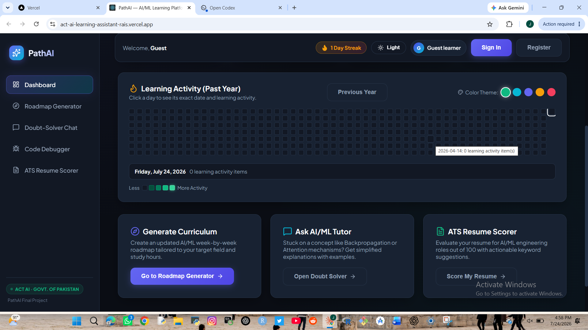

### 3. Build a tailored learning roadmap

Choose a target area, skill level, and available weekly hours to generate a structured AI/ML curriculum.

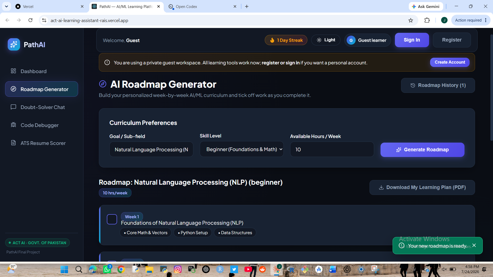

### 4. Turn a plan into visible momentum

Mark weekly roadmap items complete and keep the plan organized through the roadmap history.

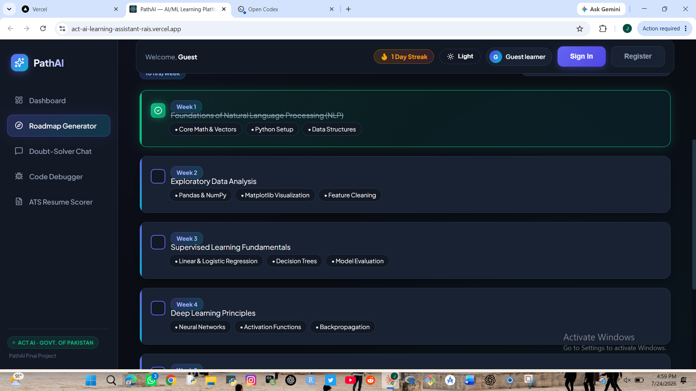

### 5. Learn with the AI tutor

Use saved conversations, flashcards, MCQ quizzes, note export, and visual flowcharts in one learning space.

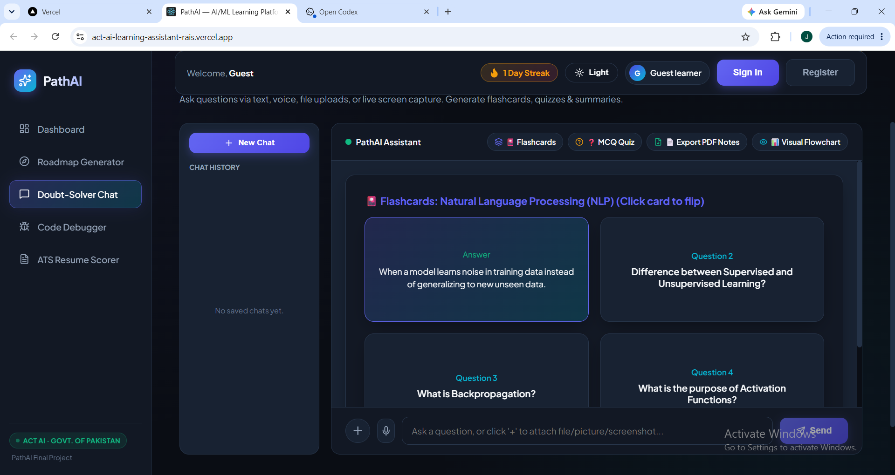

### 6. Paste a code problem

Select a language/framework or use auto-detect, then submit a code snippet or error trace.

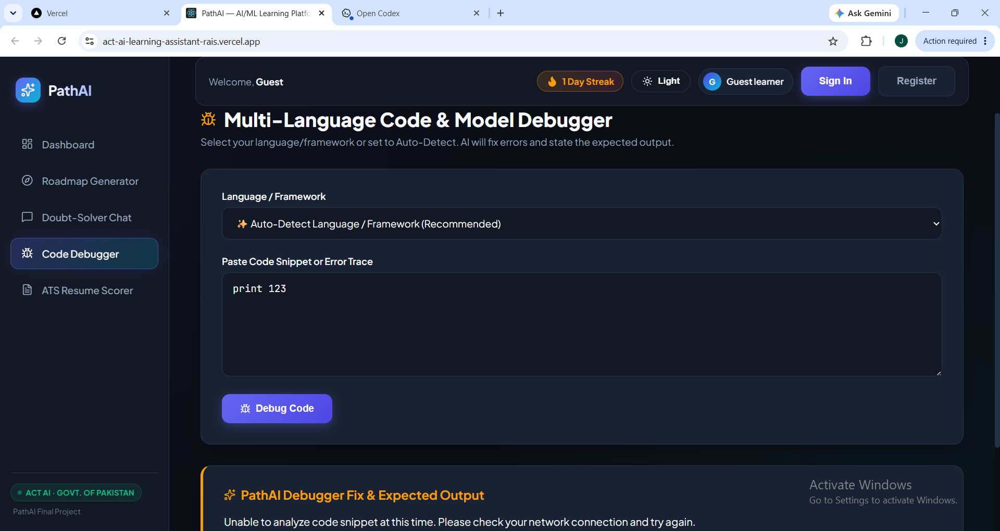

### 7. Receive an understandable debugging response

The debugger explains the likely reason, presents a corrected pattern, and describes the expected behavior - including when fallback analysis is needed.

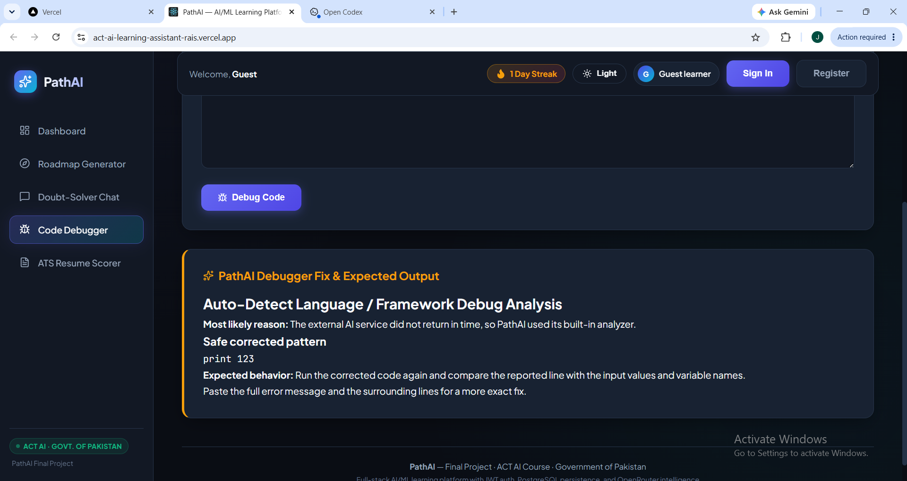

### 8. Upload a resume PDF

PathAI extracts text from PDF resumes, with OCR support for image-based/scanned documents, and pairs it with a target job description.

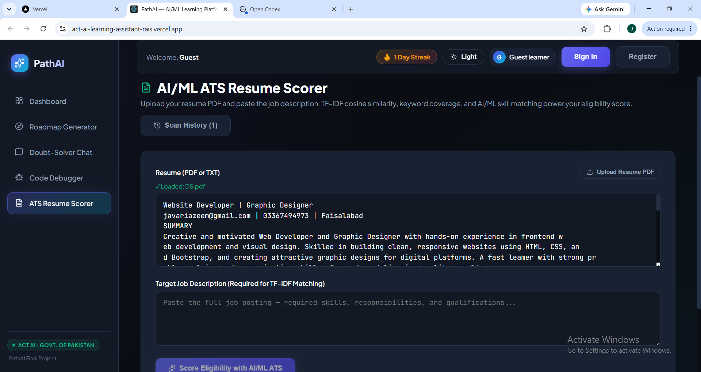

### 9. See an easy-to-understand career score

The ATS scorer presents a clear eligibility result for the chosen target role.

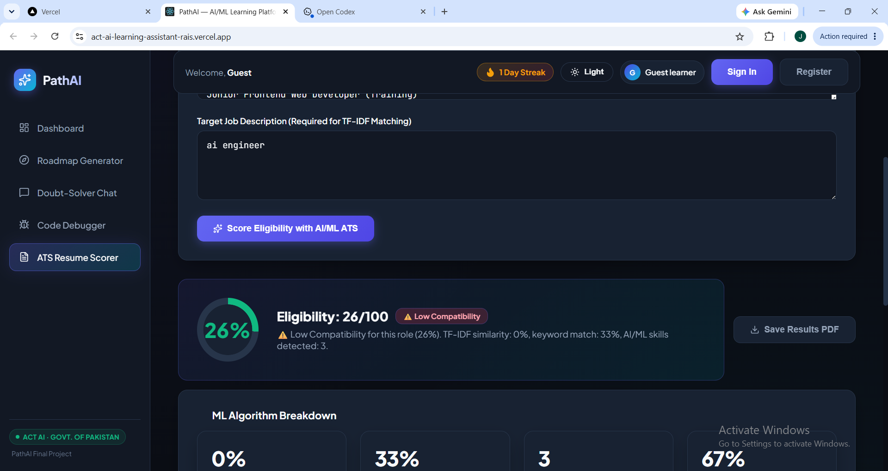

### 10. Understand how the score was calculated

The ML breakdown makes semantic similarity, keyword coverage, AI/ML skills, and section completeness transparent.

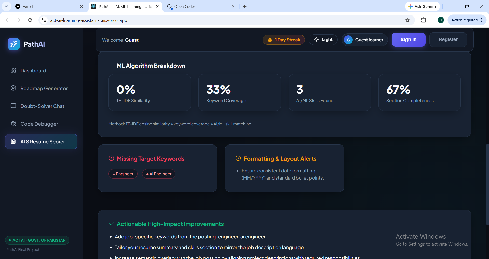

### 11. Act on professional improvement guidance

The final view turns results into practical, high-impact resume actions.

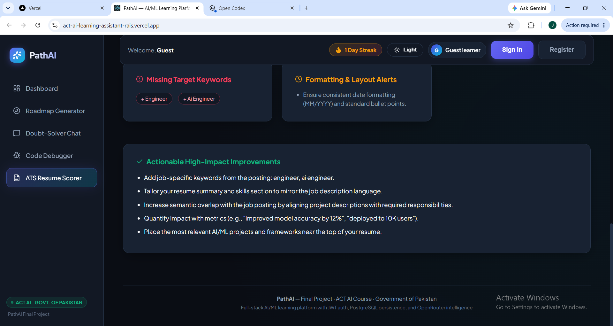

## Technology stack

| Area | Technology |
| --- | --- |
| Frontend | Next.js 16, React 19, responsive CSS |
| Backend | Next.js API routes |
| Database | PostgreSQL via Supabase and Prisma ORM |
| Authentication | JWT-based guest and registered-user sessions |
| AI integration | OpenRouter-compatible API with resilient local fallbacks |
| PDF and OCR | PDF parsing, browser PDF rendering, and Tesseract.js OCR fallback |
| Diagrams | Mermaid visual flowcharts |
| Deployment | Vercel |

## Architecture at a glance

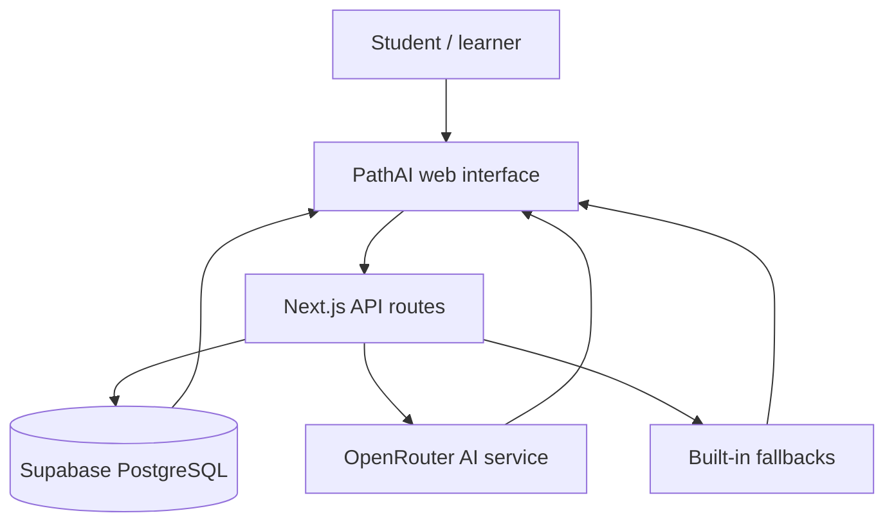

The fallback layer is intentional: core learning feedback such as debugger guidance remains useful even if an external AI request times out.

## Run PathAI locally

### Prerequisites

- Node.js 20 or later
- A PostgreSQL/Supabase project
- An OpenRouter API key for AI-powered responses

### Setup

```bash
git clone https://github.com/javariaazeemkhan478-crypto/act-ai-learning-assistant.git
cd act-ai-learning-assistant
npm install
```

Create a local environment file from the provided example:

```bash
cp .env.example .env.local
```

On Windows PowerShell, use:

```powershell
Copy-Item .env.example .env.local
```

Add your own credentials to `.env.local`, then create/update the database tables from a trusted development environment:

```bash
npx prisma db push
npm run dev
```

Open [http://localhost:3000](http://localhost:3000).

## Environment variables

| Variable | Purpose |
| --- | --- |
| `DATABASE_URL` | Supabase **transaction pooler** connection string (port 6543) used by the serverless app. |
| `DIRECT_URL` | Direct/session connection string (normally port 5432) used by Prisma schema operations and migrations. |
| `OPENROUTER_API_KEY` | Enables AI-generated tutoring, roadmap, and analysis responses. |
| `JWT_SECRET` | Long private secret used to sign authentication tokens. |

Never commit actual credentials. Use `.env.local` locally and configure the same variables in Vercel's Project Settings for production.

## Deploy on Vercel

1. Import this GitHub repository into Vercel.
2. Add `DATABASE_URL`, `DIRECT_URL`, `OPENROUTER_API_KEY`, and `JWT_SECRET` in **Project Settings -> Environment Variables**.
3. For `DATABASE_URL`, use the Supabase transaction pooler URL on port `6543` and include `pgbouncer=true`.
4. Run Prisma schema changes from a trusted development environment using the direct/session URL; do not rely on the production build to push the database schema.
5. Deploy. Vercel runs the configured build, including Prisma client generation and the Next.js production build.

The current public deployment is: **[act-ai-learning-assistant-rais.vercel.app](https://act-ai-learning-assistant-rais.vercel.app/)**

## API surface

| Area | Main routes |
| --- | --- |
| Authentication | `/api/auth/guest`, `/api/auth/register`, `/api/auth/login`, `/api/auth/me` |
| Dashboard | `/api/dashboard` |
| Roadmaps | `/api/roadmap/generate`, `/api/roadmap/history`, `/api/roadmap/items/[id]/toggle` |
| Tutor chat | `/api/chat`, `/api/chat/flashcards`, `/api/chat/mcqs`, `/api/chat/sessions` |
| Debugging | `/api/debug` |
| Resume scoring | `/api/resume/parse-pdf`, `/api/resume/score`, `/api/resume/history` |

## Project structure

```text
act-ai-learning-assistant/
|-- src/
|   |-- app/                 # Next.js pages and API routes
|   |-- components/          # Reusable interface components
|   `-- lib/                 # Prisma, auth, AI, PDF, and utility code
|-- prisma/                  # PostgreSQL schema
|-- public/                  # Public application assets
|-- docs/screenshots/        # Product walkthrough images used in this README
|-- .env.example             # Safe environment-variable template
`-- package.json
```

## Project values

PathAI is built around a simple idea: high-quality technical learning should not feel inaccessible. The platform emphasizes clear next steps, plain-language feedback, practical career support, and a welcoming path for both first-time visitors and returning learners.

It is not only a tool for an AI/ML student. It is a model for how digital learning tools can help people develop modern skills, make informed career decisions, and participate more confidently in an AI-shaped world.

## Acknowledgement

**PathAI** was created as a final project for the **ACT AI Course, Government of Pakistan**. It demonstrates a full-stack approach to AI/ML learning support: personalized learning plans, AI-assisted help, practical debugging, career readiness, and measurable progress in one deployable application.

<div align="center">

### Ready to learn with a clearer plan?

<a href="https://act-ai-learning-assistant-rais.vercel.app/"></a>

Built with purpose for AI/ML learners everywhere.

</div>
